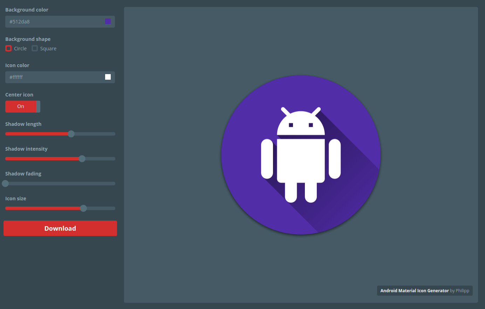

# Android Material Shadow Generator

*Android icons with that loooong material shadow for everyone!*




## Build

This project uses [brunch](http://brunch.io/) for building. Install via

```
npm install -g brunch
```

Then to start compiling + watching files run

```
npm run start
```

which will start the a local server at [http://localhost:3333](http://localhost:3333).


## Updating the Google Material Icons

To update the local [Google Material Icons](https://design.google.com/icons/) collection
run `./bin/update-material-icons.sh` which will place all icons under `app/assets/img/material-icons`
and create a file with all icon names under `app/templates/input-material-icons-data.static.jade`.


## Tests

Tests require [PhantomJS](http://phantomjs.org/) (v2.1.1), [CasperJS](http://casperjs.org/) (v1.1.0-beta5) and
the site running at http://localhost:3333 (e.g. `npm run start`). Run tests via `npm test`.


## License
Copyright 2016 Philipp Eichhorn 

Licensed under the Apache License, Version 2.0 (the "License");
you may not use this file except in compliance with the License.
You may obtain a copy of the License at

http://www.apache.org/licenses/LICENSE-2.0

Unless required by applicable law or agreed to in writing, software
distributed under the License is distributed on an "AS IS" BASIS,
WITHOUT WARRANTIES OR CONDITIONS OF ANY KIND, either express or implied.
See the License for the specific language governing permissions and
limitations under the License.
