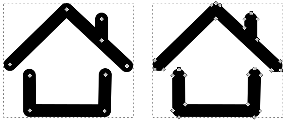

# Android Material Shadow Generator

*Android icons with that loooong material shadow for everyone!*

   


## FAQ

### Invalid custom SVG file

Here are some common causes which cause problems.

#### Paths are not closed

Make sure that your SVG file contains closed paths instead of open ones. For example



The icon on the left contains a single path (made up of two sub paths) that is open at the ends (first
node does not connect to the last node). The icon on the right has closed paths, where the shape of the paths
are that of the stroke width of the original icon.

For Inkscape users there is a nice tool that does the above conversion: "Path" -> "Stroke to Path".

#### Paths do not have a fill color

Only paths which have a fill color are imported. Any other paths are considered "invisble".


## Build

First, download / setup the dependencies:

```
npm install
```

Next get a hold of [brunch](http://brunch.io/), the build tool used for this project. To install globally:

```
npm install -g brunch
```

Then to start compiling + watching files run

```
npm start
```

which will start a local server at [http://localhost:3333](http://localhost:3333).


## Updating the Google Material Icons

To update the local [Google Material Icons](https://design.google.com/icons/) collection
run `./bin/update-material-icons.sh` which will place all icons under `app/assets/img/material-icons`
and create a file with all icon names under `app/templates/input-material-icons-data.static.jade`.


## Tests

Tests require [PhantomJS](http://phantomjs.org/) (v2.1.1), [CasperJS](http://casperjs.org/) (v1.1.0-beta5) and
the site running at http://localhost:3333 (e.g. `npm start`). Run tests via `npm test`.


## Nice to know

To directly open an specific icon in the editor, pass the url to the icon as a `icon` query parameter to the website,
for example

http://localhost:3333/?icon=/img/material-icons/action/ic_android_48px.svg


## License

Please see [LICENSE](LICENSE.md) for licensing details.

## Support or contact

For commercial use, please
[submit a request](https://goo.gl/forms/zX8GZ3Jz89SRyHdJ2) or send us an email
to material-icons@bitdroid.de.
